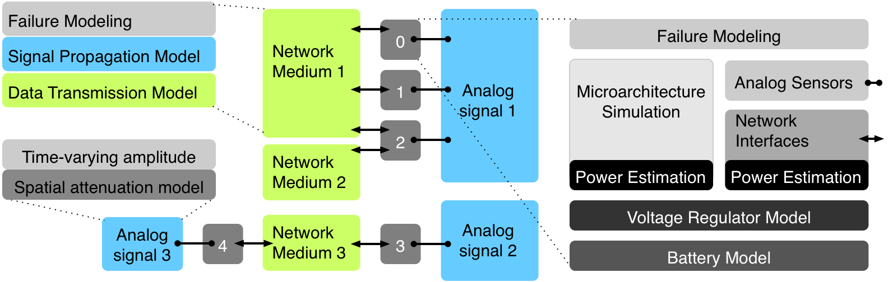

[](https://travis-ci.com/physical-computation/sunflower-simulator)


# About
Sunflower is a full-system emulator for embedded sensing, computation, communication, fault modeling, power dissipation, batteries, and more. It is designed for use in research where you would normally need to have several embedded hardware systems networked over wired or wireless interfaces. Sunflower allows you to take compiled binaries and emulate them instruction by instruction, while emulating the effect of that computation on power dissipation, emulating the effect of the power dissipation on power regulators, modeling the effect of current drawn on electrochemical battery state of charge, and doing all of this for multiple complete embedded systems (tens or even hundreds) networked over wired or wireless networks or integrated into a single chip and communicating over shared memory.
- - - -

- - - -
**Figure 1. An example of a system configuration that can be emulated in Sunflower.**

# Cloning this repository
The correct way to clone this repository to get the simulator and the submodules it depends on is:

	git clone --recursive https://github.com/physical-computation/sunflower-embedded-system-emulator.git

To update all submodules:

	git pull --recurse-submodules
	git submodule update --remote --recursive

Checkout master branch and take each submodule out of the "Detached HEAD" state:

	git submodule foreach git checkout master

# Installation instructions
Read the manual (sunflowersim-manual-and-cover.pdf) if you can. Dependencies: Building the simulator depends on GNU awk (`gawk`), on the GNU version of `bison`, the GNU version of `sed`, and `libc6-dev-i386`, so install them. To build the cross compiler `wget`, `gcc`, `libmpc`, `mpfr`, `gmp`, `gcc-multilib`, and `g++-multilib` are also required. These can be insatlled with the command `sudo apt install wget gcc libmpc-dev libmpfr-dev libgmp-dev gcc-multilib g++-multilib`.

Edit `conf/setup.conf` to match your installation directory and system setup. On macOS, use the configuration:
```
OSTYPE          = darwin
MACHTYPE        = x86_64
```

On Linux, use the configuration
```
OSTYPE          = linux
MACHTYPE        = i386
```

To configure the emulator to default to RISC-V processor support rather than Hitachi SuperH, you will want:

```
TARGET		= riscv
TARGET-ARCH	= riscv32-elf
```

Set the paths to the GNU awk, GNU bison, and GNU sed in `conf/setup.conf`.

Once you have edited `conf/setup.conf`, follow the instructions below to build the cross-compiler:
1. Change directory to `tools/source` from the root of the Sunflower tree.
2. Run `./downloads.sh` in the directory `tools/source` relative to the root of the Sunflower tree. This will download the source for various tools needed for building the cross-compilers.
3. From the root of the Sunflower tree, run `make cross-superH` to build the Hitachi SH cross compiler or `make cross-riscv` to build the RISC-V cross compiler.
4. Change directory to `sim` from the root of the Sunflower tree.
5. Run `make` to build the sunflower simulator itself.
6. To run the sunflower simulator from any directory just by using the `sf` command, the `sim` directory needs to be added to `PATH`. This can be done with the command `export PATH="$PATH:path/to/sim/directory"`, filling in the correct path to your `sim` directory. If this command works as expected you can make it permanent by adding it to the bottom of your `~/.bashrc` file.

**If you have trouble building on macOS, you might be running into [this](https://github.com/physical-computation/sunflower-simulator/issues/123) issue.**

## The role of `setup.conf`
The configuration file `conf/setup.conf` sets global configuration parameters needed by other tools, such as specifying what your workstation architecture is.

The `conf/setup.conf` configuration file does not influence which processor architectures Sunflower supports: Sunflower by default has support for all architectures enabled and you can create a simulation instance with multiple embedded systems each of a different architecture, all running simultaneously and interacting with each other. The default processor instances when you launch `sim` are SuperH. You can create RISC-V instances using the sunflower command `newnode riscv`. You can explicitly request SuperH instances using the command `newnode superh`. You can have a mix of SuperH and RISC-V processors in the same simulation (i.e., in the same launch of `sim`). From the simulator’s perspective, both architectures are always supported and it is not possible to purposefully configure the `sim` for one or the other.

# Command history
To keep the emulator implementation independent of any third-part libraries, the Sunflower REPL does not integrate command history (e.g., using the `readline` library). If you want command history, use [rlwrap](https://github.com/hanslub42/rlwrap).

# If you use Sunflower in your research, please cite it as:
Phillip Stanley-Marbell and Michael Hsiao. “Fast, Flexible, Cycle-accurate Energy Estimation”. In *Proceedings of the 2001 International Symposium on Low Power Electronics and Design, ISLPED ’01*. Huntington Beach, California, USA: ACM, pp. 141–146. ISBN: 1-58113-371-5. doi: 10.1145/ 383082.383120.

**BibTeX:**
````
@inproceedings{Stanley-Marbell:2001:FFC,
 author = {Phillip Stanley-Marbell and Michael Hsiao},
 title = {Fast, Flexible, Cycle-accurate Energy Estimation},
 booktitle = {Proceedings of the 2001 International Symposium 
              on Low Power Electronics and Design},
 series = {ISLPED '01},
 year = {2001},
 isbn = {1-58113-371-5},
 location = {Huntington Beach, California, USA},
 pages = {141--146},
 numpages = {6},
 publisher = {ACM},
 address = {New York, NY, USA},
}
````

Phillip Stanley-Marbell and Diana Marculescu. “Sunflower: Full-system, Embedded, Microarchitecture Evaluation”. In *Proceedings of the 2nd International Conference on High Performance Embedded Architectures and Compilers. HiPEAC’07*. Ghent, Belgium: Springer-Verlag, pp. 168–182. ISBN: 978-3-540-69337-6.

**BibTeX:**
````
@inproceedings{Stanley-Marbell:2007:SFE,
 author = {Phillip Stanley-Marbell and Diana Marculescu},
 title = {Sunflower: Full-system, Embedded, Microarchitecture Evaluation},
 booktitle = {Proceedings of the 2nd International Conference on 
              High Performance Embedded Architectures and Compilers},
 series = {HiPEAC'07},
 year = {2007},
 isbn = {978-3-540-69337-6},
 location = {Ghent, Belgium},
 pages = {168--182},
 numpages = {15},
 publisher = {Springer-Verlag},
 address = {Berlin, Heidelberg},
}
````
